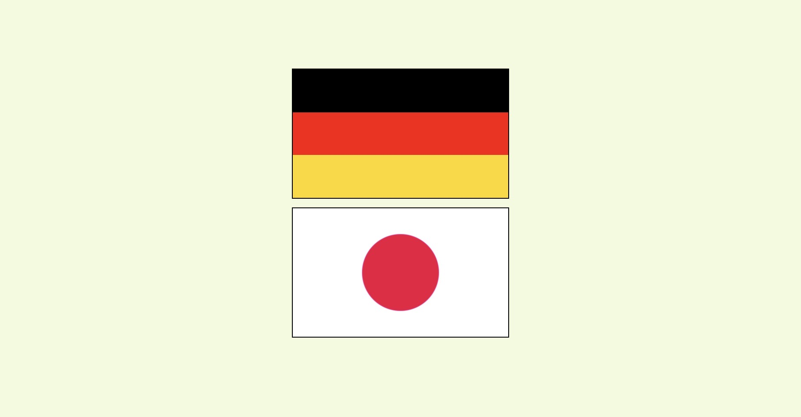

# Gradients

## :cartwheeling: Übung

# Erstelle zwei verschiedene Flaggen die japanische Flagge und die deutsche Flagge — nur mit CSS-Gradients.

**Japanische Flagge**

Verwende eine radialen Verlauf (radial-gradient), um die japanische Flagge zu erstellen.
Die Flagge soll einen weißen Hintergrund und einen roten Kreis in der Mitte haben.
Der Durchmesser des roten Kreises soll ungefähr ein Drittel der Höhe der Flagge betragen und exakt in der Mitte positioniert sein.

**Deutsche Flagge**

Verwende einen linearen Verlauf (linear-gradient), um die deutsche Flagge zu erstellen.
Die Flagge soll drei horizontale Streifen in den Farben Schwarz, Rot und Gold enthalten.
Die Farben sollen gleichmäßig aufgeteilt sein, wobei jeder Streifen ein Drittel der Höhe der Flagge einnimmt.

